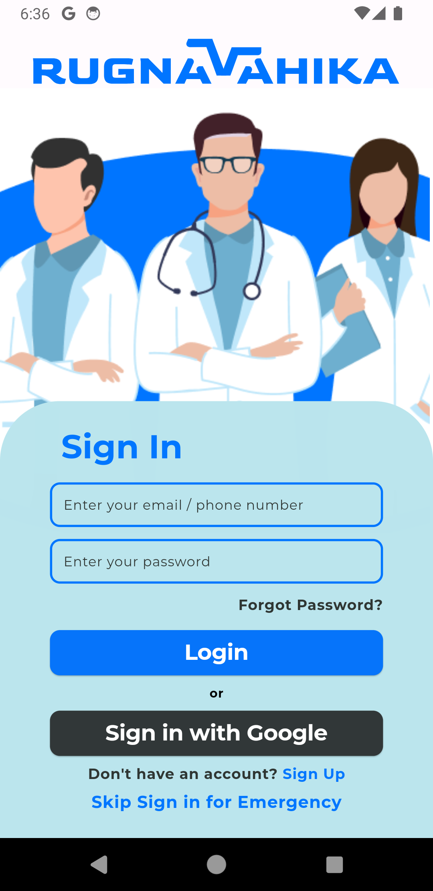
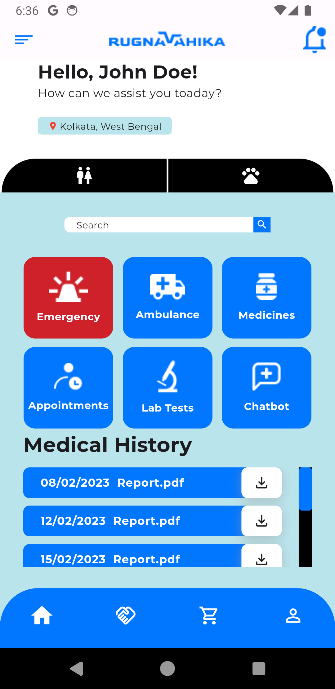
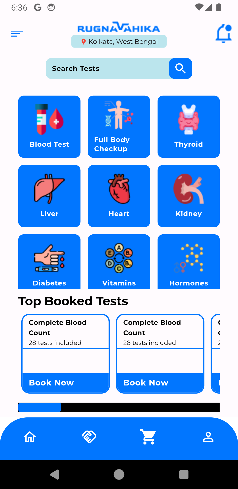
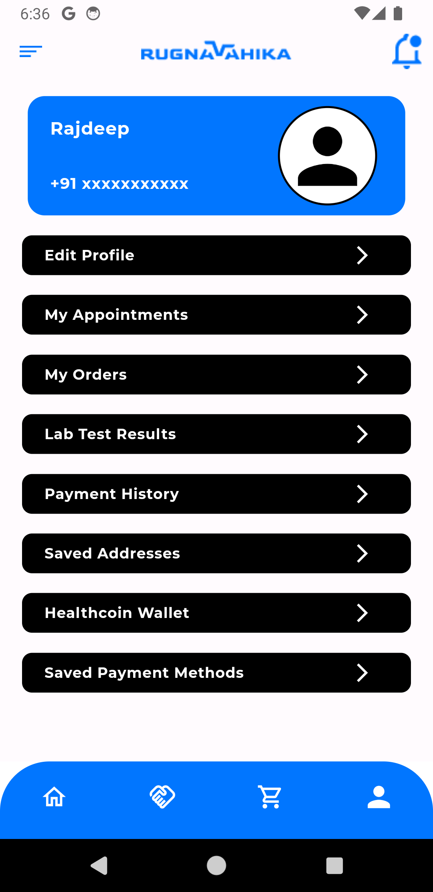

# Rugnavahika

Ruganavahika aims to quickly book an ambulance from the partnered hospitals for injured people and animals, the app also aims to deliver medicines and book lab tests. In case it's an emergency, the app doesn't require the user to sign up, they can directly book an ambulance and the app will automatically send the user's location to the hospital

## Preview of the app

  

  

  

  

